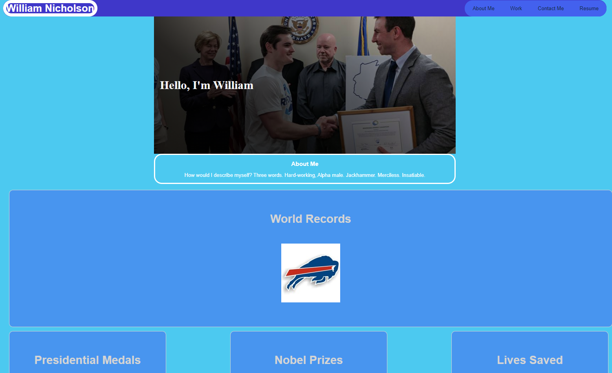
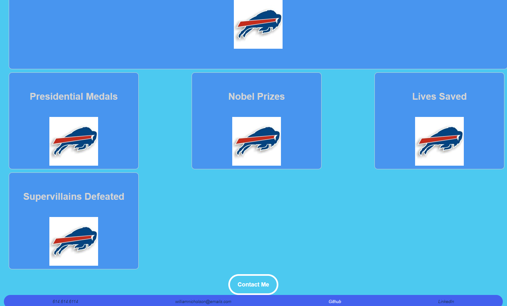

# 02 Advanced CSS: Portfolio

## Description

This is William Nicholon's portfolio webpage that is designed to make 
it easy for potential employers to view his work and understand his
strengths as a web developer.

### Features

The webpage features a picture of Will, links to his work, resume, and
contact info, and a box-style layout that is optimized for different
browsers and screens.

### Visuals

### Links
[deployedApplication] https://will98nicholson.github.io/hw2/

